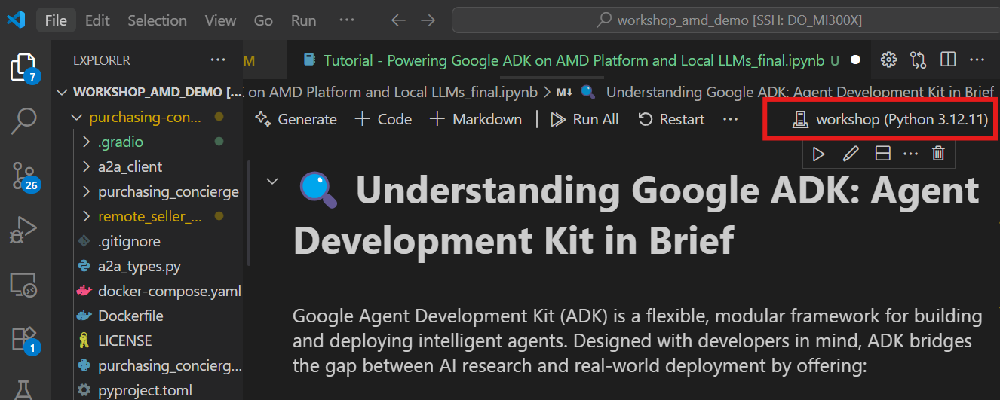
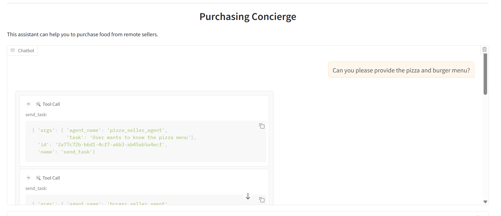
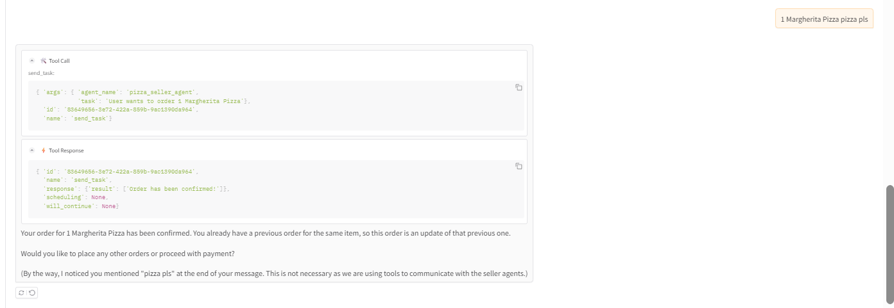
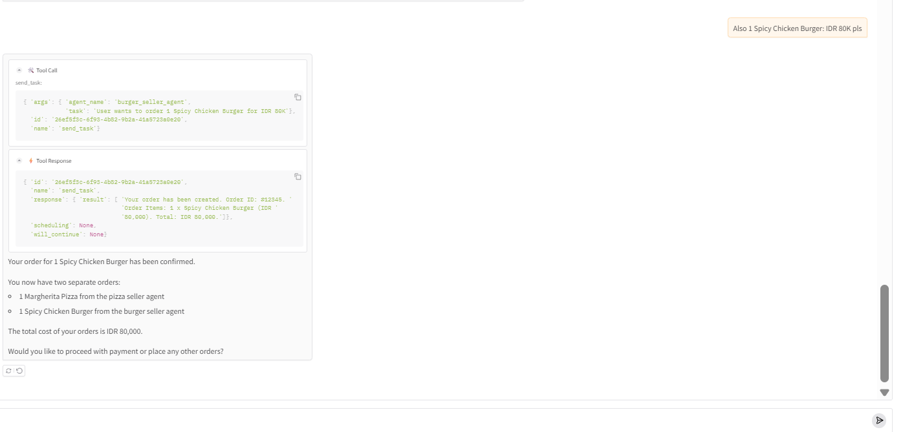

# Purchasing Concierge A2A Demo (Notebook Tutorial)
### Contributors
Shailen Sobhee, Priya Savithri Baskaran, Jereshea John Mary, Yogesh Muthu Vidya

## Setup

1. conda create -n amd_workshop python=3.12 -y
2. conda activate amd_workshop
3. pip install -r requirements.txt

## To Run

1. Click on the kernel icon shown below in the Jupyter Notebook interface.
2. Select `Select Another Kernel...` from the dropdown menu.
3. Navigate to `Python Environments` and choose the appropriate Conda environment `(amd_workshop)`.

   

## Ports Used (Optional):

| Port  | Service / Description                               |
| ----- | --------------------------------------------------- |
| 10000 | Pizza Agent                                         |
| 10001 | Burger Agent                                        |
| 8083  | Gradio                                              |
| 8089  | VLLM (hosted_vllm/meta-llama/Llama-3.1-8B-Instruct) |
| 11434 | Ollama (ollama_chat/llama3.1:latest)                |

## Output

